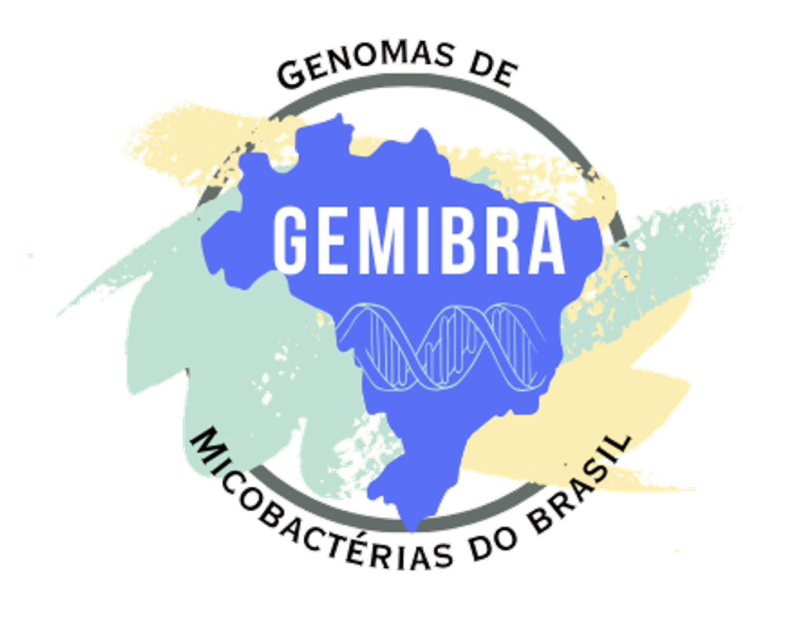

# **Ge**nomas De **Mi**cobactérias No **Bra**sil
## GEMIBRA v.2.0

## Bem-vindo ao Projeto GEMIBRA!
Esta plataforma digital é dedicada à agregação de dados públicos de sequenciamento genômico (Whole-Genome Sequencing - WGS) de micobactérias isoladas no Brasil. Nosso objetivo é promover a pesquisa e apoiar ações de saúde pública de precisão, com foco na vigilância em saúde. Esta iniciativa teve suas origens em 2018, quando uma análise aprofundada da literatura existente, publicada em 2020, apontou a necessidade de uma nova abordagem. Para mais detalhes sobre a pesquisa e o projeto, clique aqui.

## Sobre nós
Somos uma equipe interdisciplinar de pesquisadores e educadores, incluindo professores, estudantes de graduação e pós-graduação, com atuação em instituições renomadas de pesquisa e ensino:

* Instituto Evandro Chagas (IEC) – Pará, Brasil
* Instituto Oswaldo Cruz (FIOCRUZ) – Rio de Janeiro, Brasil
* Universidade de Stellenbosch – Cidade do Cabo, África do Sul
* Escola de Higiene e Medicina Tropical de Londres – Faculdade Universitária de Londres, Reino Unido
* Consórcio REVIGET N/NE

Nosso foco está em compreender a diversidade genômica de micobactérias no Brasil e no mundo para melhorar a saúde pública por meio de pesquisa de ponta.

## Visão Geral das Micobactérias
As micobactérias englobam mais de 190 espécies, divididas em três grupos principais:

1.	Complexo _Mycobacterium tuberculosis_ (CMTB) – O principal responsável pela tuberculose em humanos e animais.
2.	Micobactérias Não Causadoras de Tuberculose (MNT) – Presentes em diversos ambientes, podendo causar infecções oportunistas conhecidas como micobacterioses.
3.	_Mycobacterium leprae_ e _Mycobacterium lepromatosis_ – Os principais causadores da hanseníase, doença crônica que afeta pele, nervos e outros tecidos.

Embora o gênero Mycobacterium tenha sido divido em cinco gêneros em 2018 (Mycobacterium; Mycolicibacter; Mycolicibacillus; Mycolicibacterium; Mycobacteroides) (Gupta et al., 2018), ele fora novamente reclassificado como apenas Mycobacterium em 2021, sendo ambas as classificações aceitas pela norma taxonômica (Conor et al., 2021).

Os membros do CMTB podem ser interpretados como ecotipos, subespécies ou até mesmo como uma única espécie, M. tuberculosis, que se subdivide em diferentes variantes: M. tuberculosis var. tuberculosis, M. tuberculosis var. africanum, M. tuberculosis var. canettii, M. tuberculosis var. bovis, M. tuberculosis var. caprae, M. tuberculosis var. microtii, M. tuberculosis var. pinnipedii, M. tuberculosis var. mungi e M. tuberculosis var. orygis (Riojas et al., 2018). Esse grupo é responsável por causar tuberculose tanto em humanos quanto em animais, com algumas variantes adaptadas especificamente aos humanos (M. tuberculosis e M. africanum), enquanto outras estão adaptadas aos animais.
O grupo das Micobactérias Não Causadoras de Tuberculose (MNT) é o mais extenso, englobando atualmente mais de 140 espécies. Essas micobactérias são organismos de vida livre, amplamente distribuídos no ambiente, e podem causar infecções oportunistas conhecidas como micobacterioses. Essas infecções podem ser facilmente confundidas com tuberculose, seja pulmonar ou extrapulmonar, o que representa um grande desafio tanto para o diagnóstico quanto para o tratamento clínico.
As espécies M. leprae e M. lepromatosis são os principais agentes etiológicos da hanseníase, uma doença infecciosa crônica que afeta a pele, nervos e outros tecidos. Essas espécies não podem ser cultivadas em meios artificiais, pois precisam de células hospedeiras para crescer. Além disso, seu crescimento é extremamente lento, demorando anos para formar lesões visíveis.

## Banco de Dados GEMIBRA (Atualização: 20 de julho de 2024)
Nosso banco de dados fornece acesso público a genomas do CMTB e futuramente incluirá dados sobre MNT e M. leprae.

* **CMTB**: 2999 genomas 
* **MNT**: Em andamento
* ***M. leprae***: Em construção

## Fale Conoso
Se você deseja contribuir com o projeto ou tem dúvidas, envie-nos uma mensagem:
**E-mail**: projetogemibra@gmail.com
 
